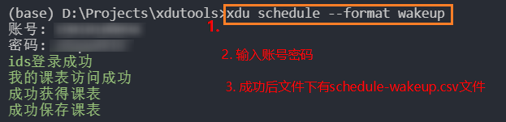

# XDU Tools

- 工具实现了对西电网站和西电一站式服务大厅apps的cookies的获取
- CLI调用工具接口

## 安装

```bash
// 假设已有python3环境
mkdir xduapps
cd xduapps
git clone git@github.com:ShoorDay/xduapps.git
// 或者http下载 https://github.com/ShoorDay/xduapps.git
pip install .
// 检查
xdu --help
```

## 课表查询

```bash
xdu schedule --format=wakeup
```
默认保存为csv格式, 目前可选`[simple|csv|wakeup]`
- csv为默人保存格式
- simple对应Android应用[Simple课程表](https://www.coolapk.com/apk/com.strivexj.timetable)的文件导入格式
- wakeup对应Android应用[WakeUp课程表](https://www.coolapk.com/apk/com.suda.yzune.wakeupschedule)的Excel导入格式

~~推荐使用Simple课程表~~
推荐使用WakeUp课程表
1. 获得schedule-wakeup.csv文件

文件保存在`setup.py`同级目录
1. 发送文件到手机
推荐使用微信/Tim/QQ, `WakeUp课程表`为此做了优化, 容易找到
3. WakeUp课程表内导入
- 选择从EXCEL导入, 找到手机上的文件,导入即可
- 核对课程表, 设置WakeUp
4. 更进一步
WakeUp提供了导出ICS的功能, 可以尝试
注意一定要确保课程对应

## 注意

1. 对于网络、登录成功没有做任何检查, 请在网络良好下使用, 并确保账号密码正确
2. 西电接口多变, 可能明年就不能用了:cry

## 其他

- 以后有时间完善课表查询功能
- 一站式服务大厅的其他应用以后也看看

## Disclaimer
